<style type="text/css">
slides > slide:not(.nobackground):after {
  content: '';
}
</style>

```{r setup, include=FALSE}
knitr::opts_chunk$set(echo = FALSE, dev.args = list(bg = 'transparent'), dev='pdf')
```

# Introduction

## Insertions and deletions

```{r, echo=FALSE, warning=FALSE, include=FALSE}

# sfs plot

library('ggplot2')
library('gridExtra')
library('dplyr')
plot_base_size = 30

```

- short INDELs: sections of DNA < 50bp that are deleted or inserted in a genome
<!--
- deletion bias in most organisms
- deletions more deleterious than insertions
-->

\  

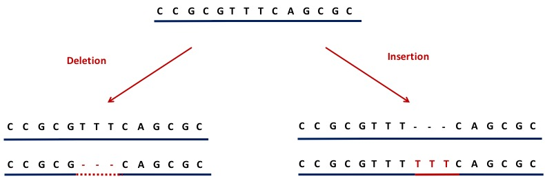

## INDELs often overlooked

- Disproportionately occur in repetitive sequence
- Hard to align
- Often occur in hotspots
- 1/8 as frequent as SNPs in humans

\   
\  
\  
\  
\  
\  

<div style="position:absolute;bottom:4%;left:5%;width:450px;font-size:11pt;"> (Earl et al., 2014; Montgomery et al., 2013) </div>

## The importance of INDELs in genome evolution

* Contribute more to sequence divergence, in terms of the number of base differences, than SNPs  

* Influence genome size:
    * low deletion rate $\rightarrow$ large genomes?
    * high deletion rate $\rightarrow$ compact genomes?


\   
\  
\  
\  

<div style="position:absolute;bottom:4%;left:5%;width:900px;font-size:11pt;"> (Britten, 2002; Nam and Ellegren, 2012; Ometto et al., 2005; Sun et al., 2012) </div>

<!---
## INDEL mutation

  * Deletion bias in most organisms
  * Polymerase slippage can explain majority of short INDEL events
  
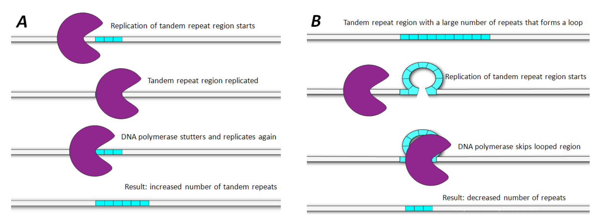

<div style="position:absolute;bottom:4%;left:5%;width:900px;font-size:11pt;">
<http://www.microtyping.nl/content/2011/11/MLVA>
</div>
--->

## INDEL selection

* Deletions
    * lower mean allele frequency 
    * more deleterious
    * two breakpoints
  
* Insertions may be favoured:
    * elevated fixation probability
    * biased gene conversion
    * minimum intron size
    
* Polarisation error
  
<div style="position:absolute;bottom:4%;left:5%;width:900px;font-size:11pt;"> (Leushkin and Bazykin, 2013; Ometto et al., 2005; Petrov, 2002; Sjödin et al., 2010) </div>

## Importance of polarisation error

```{R, echo=FALSE, warning=FALSE, fig.width=16, fig.height=9}
# data const
true_ins = data.frame(c(0.1, 0.2, 0.3, 0.4, 0.5, 0.6, 0.7, 0.8, 0.9), c(8, 4, 3, 2.5, 2, 1.8, 1.6, 1.5, 1.4))
colnames(true_ins) <- c('freq', 'prop')
true_ins$var = 'insertions'
true_ins$group = 'true'
true_del = data.frame(c(0.1, 0.2, 0.3, 0.4, 0.5, 0.6, 0.7, 0.8, 0.9), c(16, 8, 7, 5, 4, 3.5, 3, 2.9, 2.8))
colnames(true_del) <- c('freq', 'prop')
true_del$var = 'deletions'
true_del$group = 'true'

# insertion error
error_ins_1 = data.frame(c(0.1, 0.2, 0.3, 0.4, 0.5, 0.6, 0.7, 0.8, 0.9), c(2, 1, 0, 0, 0, 0, 0, 0, 0))
colnames(error_ins_1) <- c('freq', 'prop')
error_ins_1$var = 'insertions'
error_ins_1$group = 'ins_loss'
error_ins_2 = data.frame(c(0.1, 0.2, 0.3, 0.4, 0.5, 0.6, 0.7, 0.8, 0.9), c(0, 0, 0, 0, 0, 0, 0, 1, 2))
colnames(error_ins_2) <- c('freq', 'prop')
error_ins_2$var = 'deletions'
error_ins_2$group = 'del_gain'

#deletion error
error_del_1 = data.frame(c(0.1, 0.2, 0.3, 0.4, 0.5, 0.6, 0.7, 0.8, 0.9), c(4, 2, 0, 0, 0, 0, 0, 0, 0))
colnames(error_del_1) <- c('freq', 'prop')
error_del_1$var = 'deletions'
error_del_1$group = 'del_loss'
error_del_2 = data.frame(c(0.1, 0.2, 0.3, 0.4, 0.5, 0.6, 0.7, 0.8, 0.9), c(0, 0, 0, 0, 0, 0, 0, 2, 4))
colnames(error_del_2) <- c('freq', 'prop')
error_del_2$var = 'insertions'
error_del_2$group = 'ins_gain'

true_indel = rbind(true_del, true_ins, error_ins_1, error_ins_2, error_del_1, error_del_2)
ggplot(true_indel, aes(x=as.factor(freq), y=prop, fill=group)) + 
  geom_bar(stat='identity') +
  facet_wrap(~var) +
  theme_grey(base_size=plot_base_size) +
  xlab('Frequency of derived allele') + ylab('INDEL count') +
  scale_fill_manual(values=c(NA, 'dark grey', NA, 'dark grey', 'dark grey'), guide='none')

# del_gain, del_loss, ins_gain, ins_loss, true
```

<div style="position:absolute;bottom:4%;left:5%;width:900px;font-size:11pt;"> (see Hernandez et al., 2007) </div>

## Importance of polarisation error

```{R, echo=FALSE, warning=FALSE, fig.width=16, fig.height=9}
ggplot(true_indel, aes(x=as.factor(freq), y=prop, fill=group)) + 
  geom_bar(stat='identity') +
  facet_wrap(~var) +
  theme_grey(base_size=plot_base_size) +
  xlab('Frequency of derived allele') + ylab('INDEL count') +
  scale_fill_manual(values=c(NA, 'dark grey', NA, 'steel blue', 'dark grey'), guide='none')

# del_gain, del_loss, ins_gain, ins_loss, true
```

<div style="position:absolute;bottom:4%;left:5%;width:900px;font-size:11pt;"> (see Hernandez et al., 2007) </div>

## Importance of polarisation error

```{R, echo=FALSE, warning=FALSE, fig.width=16, fig.height=9}
ggplot(true_indel, aes(x=as.factor(freq), y=prop, fill=group)) + 
  geom_bar(stat='identity') +
  facet_wrap(~var) +
  theme_grey(base_size=plot_base_size) +
  xlab('Frequency of derived allele') + ylab('INDEL count') +
  scale_fill_manual(values=c('steel blue', 'dark grey', NA, NA, 'dark grey'), guide='none')

# del_gain, del_loss, ins_gain, ins_loss, true
```

<div style="position:absolute;bottom:4%;left:5%;width:900px;font-size:11pt;"> (see Hernandez et al., 2007) </div>

## Importance of polarisation error

```{R, echo=FALSE, warning=FALSE, fig.width=16, fig.height=9}
ggplot(true_indel, aes(x=as.factor(freq), y=prop, fill=group)) + 
  geom_bar(stat='identity') +
  facet_wrap(~var) +
  theme_grey(base_size=plot_base_size) +
  xlab('Frequency of derived allele') + ylab('INDEL count') +
  scale_fill_manual(values=c('steel blue', 'tomato 3', NA, NA, 'dark grey'), guide='none')

# del_gain, del_loss, ins_gain, ins_loss, true
```

<div style="position:absolute;bottom:4%;left:5%;width:900px;font-size:11pt;"> (see Hernandez et al., 2007) </div>

## Importance of polarisation error

```{R, echo=FALSE, warning=FALSE, fig.width=16, fig.height=9}
ggplot(true_indel, aes(x=as.factor(freq), y=prop, fill=group)) + 
  geom_bar(stat='identity') +
  facet_wrap(~var) +
  theme_grey(base_size=plot_base_size) +
  xlab('Frequency of derived allele') + ylab('INDEL count') +
  scale_fill_manual(values=c('steel blue', NA, 'tomato 3', NA, 'dark grey'), guide='none')

# del_gain, del_loss, ins_gain, ins_loss, true
```

<div style="position:absolute;bottom:4%;left:5%;width:900px;font-size:11pt;"> (see Hernandez et al., 2007) </div>

## Importance of polarisation error

```{R, echo=FALSE, warning=FALSE, fig.width=16, fig.height=9}
ggplot(true_indel, aes(x=as.factor(freq), y=prop, fill=group)) + 
  geom_bar(stat='identity') +
  facet_wrap(~var) +
  theme_grey(base_size=plot_base_size) +
  xlab('Frequency of derived allele') + ylab('INDEL count') +
  scale_fill_manual(values=c('dark grey', NA, 'dark grey', NA, 'dark grey'), guide='none')

# del_gain, del_loss, ins_gain, ins_loss, true
```

<div style="position:absolute;bottom:4%;left:5%;width:900px;font-size:11pt;"> (see Hernandez et al., 2007) </div>

## Aims

Overcome confounding affect of polarisation error

Quantify how natural selection shapes INDEL diversity in the great tit (*Parus major*)

1) within coding regions
2) in non-coding regions


## Advantages of an avian system

- Conserved karyotype and synteny - good for alignments
- Genomes consist of few large macrochromosomes and many small microchromosomes
- Results in a highly dynamic recombination landscape - power to associations with recombination


\  
\ 

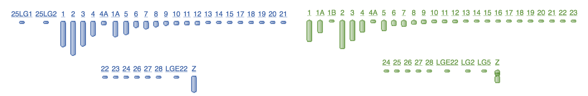

<div style="position:absolute;bottom:4%;left:5%;width:450px;font-size:11pt;"> (van Oers et al., 2014; Stapley et al., 2008) </div>

# Tackling polarisation error

## A novel maximum likelihood approach

  * 'anavar' 
  * takes the unfolded site frequency spectrum
  * estimates for both insertions and deletions:
    * mutation rate ($\theta = 4N_e\mu$)
    * **the distribution of fitness effects (DFE)**
    * polarisation error ($\epsilon$)
  * Controls for demography using neutral sites (Eyre-Walker et al., 2006)
  * Applicable to both INDELs and SNPs or a combination

<div style="position:absolute;bottom:4%;left:5%;width:450px;font-size:11pt;"> (Barton and Zeng, MBE, 2018) </div>

<!---
## What is the DFE?

```{r, echo=FALSE, warning=FALSE, message=FALSE, fig.width=16, fig.height=9}
library(viridis)
sim_gamma <- data.frame(gamma = rgamma(100000, shape = 7, rate = 1))

ggplot(sim_gamma, aes(x=gamma)) +
  geom_histogram(alpha=0.2, colour=viridis(3)[2]) +
  geom_freqpoly(colour=viridis(3)[1], size=3) +
  theme_classic(base_size = plot_base_size) +
  xlab(expression(-gamma/(4*N[e]*s))) + ylab('Density') +
  theme(axis.text.y=element_blank())

```
--->

## The model can describe the DFE in two ways

```{r, echo=FALSE, warning=FALSE, message=FALSE, fig.width=16, fig.height=9}
discrete_g = data.frame(gamma=c(-8, -0.8, -5, -0.5), var_type=c('DEL','DEL', 'INS', 'INS'), theta=c(0.002, 0.0002, 0.001, 0.0001), s_class=c(1,2,1,2), prop=c(0.4, 0.6, 0.2, 0.8))

discrete_plot = ggplot(discrete_g, aes(x=-1*gamma, y=prop, fill=var_type)) +
  geom_col(stat='identity') +
  scale_fill_manual(values = viridis(n=3)) +
  theme_grey(base_size = plot_base_size) +
  xlab(expression(-gamma)) +
  ylab('proportion') + xlim(0, 20) +
  theme(legend.position = c(0.8, 0.8), legend.title=element_blank(),
        axis.text.y=element_blank()) + ggtitle('Discrete DFE')

gdistdel <- rgamma(100000, shape = 0.6, rate = 1/800)
delg <- data.frame(gamma = gdistdel, var_type='DEL')
gdistins <- rgamma(100000, shape = 0.5, rate = 1/250)
insg <- data.frame(gamma = gdistins, var_type='INS')

#delg <- data.frame(gamma = c(-8:0), theta = c(3^(9:1)), var_type='DEL')
#insg <- data.frame(gamma = c(-8:0/0.8), theta = c(3^(9:1)), var_type='INS')

continuous_g = subset(rbind(insg, delg), gamma>0)

continuous_g$var_type <- factor(continuous_g$var_type, levels=c('DEL', 'INS'))

continuous_plot = ggplot(continuous_g, aes(x=gamma/10, colour=var_type, fill=var_type)) +
  geom_density(alpha=0.5) +
  theme_grey(base_size = plot_base_size) +
  xlab(expression(-gamma)) + ylab('proportion') +
  scale_colour_manual(values = viridis(n=3)) + scale_fill_manual(values = viridis(n=3)) + xlim(0, 20) +
  theme(axis.text.y=element_blank(),
        legend.position = c(0.8, 0.8), legend.title=element_blank()
        ) + ggtitle('Continuous DFE')


grid.arrange(continuous_plot, discrete_plot, nrow=1)
```


<div style="position:absolute;bottom:4%;left:5%;width:450px;font-size:11pt;"> (Barton and Zeng, MBE, 2018) </div>

<!---
## Predicts the DFE well, with polarisation error

```{r, echo=FALSE, warning=FALSE, message=FALSE, fig.width=16, fig.height=9}
data_sim = read.delim('anavar_sim_data.txt')

data_sim$error = ifelse(data_sim$var_type == 'del', 4, 8) 
data_sim$new_var = paste(toupper(data_sim$var_type), ' (polarisation error = ', data_sim$error, '%)', sep='')

ggplot(data_sim, aes(x=gamma, fill=data_type, colour=data_type))+
       geom_density(alpha = 0.2, n = 50000) +
       facet_wrap(~new_var, nrow=1) + coord_cartesian(xlim=c(0, 10), ylim=c(0,1)) +
       scale_colour_manual(values=c(NA, NA, viridis(4)[3], NA)) + scale_fill_manual(values=c(NA, NA, viridis(4)[3], NA)) +
  xlab(expression(-gamma)) +
  theme_grey(base_size = plot_base_size) +
  theme(legend.title = element_blank(), legend.position = c(0.8, 0.8))

```

## Predicts the DFE well, with polarisation error

```{r, echo=FALSE, warning=FALSE, message=FALSE, fig.width=16, fig.height=9}
ggplot(data_sim, aes(x=gamma, fill=data_type, colour=data_type))+
       geom_density(alpha = 0.2, n = 50000) +
       facet_wrap(~new_var, nrow=1) + coord_cartesian(xlim=c(0, 10), ylim=c(0,1)) +
       scale_colour_manual(values=viridis(4)) + scale_fill_manual(values=viridis(4)) +
  xlab(expression(-gamma)) +
  theme_grey(base_size = plot_base_size) +
  theme(legend.title = element_blank(), legend.position = c(0.8, 0.8))

```
--->
# Applying the model to the great tit

## Sample and pipeline

- 10 european great tit males (Corcoran et al., 2017)
- high coverage (44x)
- variant calling with GATK
- multispecies alignment between zebra finch, flycatcher and great tit
- parsimony based polarisation

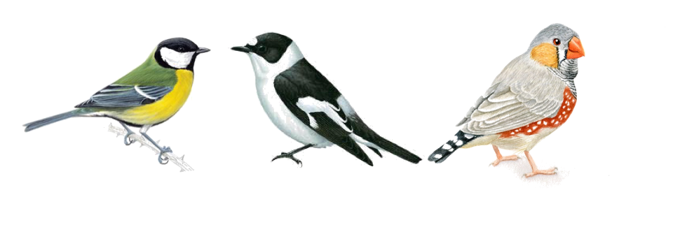

## Summarising the data set

```{r, echo=FALSE, warning=FALSE, message=FALSE, fig.width=16, fig.height=9}

pal4 = viridis(n=5)

## divergence
div = read.delim('~/parus_indel/summary_analyses/gt_indel_div.txt')
snp_div = read.delim('~/parus_indel/summary_analyses/snp_div.txt', header=FALSE)
snp_div$variation = 'SNP'
snp_div = data.frame(cbind(as.character(snp_div$V1),snp_div$variation, snp_div$V2))
colnames(snp_div) = c('category', 'variation', 'divergence')
snp_div$divergence = as.numeric(as.character(snp_div$divergence))#/10

div = subset(div, category!='noncoding' & category != 'UCNE' & category != 'ALL')
div = subset(div, select=c(category, variation, divergence))
div = rbind(div, snp_div)

div$category = factor(div$category,
  levels=rev(c('CDS', 'intergenic', 'introns', 'AR')))

div_plot = ggplot(subset(div, variation!='DEL' & variation!='INS'), aes(x=category, y=divergence, fill=variation)) +
    geom_bar(stat='identity', size=2, position = position_dodge(width=0.9)) +
    theme_grey(base_size=plot_base_size) +
    xlab('') + ylab('divergence') +
    theme(axis.text.x = element_text(angle = 45, hjust = 1),
    legend.title=element_blank(), legend.position='None',
    legend.background=element_blank()) +
    guides(colour = guide_legend(nrow = 1))+
    #annotate("text", x = 3.5, y = 0.0065,
    #          label = '(SNPs: divergence = true divergence / 10)', size=6) +
    scale_fill_manual(values=viridis(n=3))

## tajd
summary_data = read.delim('~/parus_indel/summary_analyses/bgi10_stats.txt', na=0)
call_data = read.delim('~/parus_indel/summary_analyses/bgi10_call.txt')

all_data = cbind(summary_data, call_data)

all_data[7] = NULL
all_data[7] = NULL

all_data$tw_per_site = all_data$theta_w / all_data$call
all_data$pi_per_site = all_data$pi / all_data$call

all_data = subset(all_data, category != 'noncoding_noUCNEs'
  & category != 'cds_frameshift' & category != 'cds_non_frameshift'
  & category != 'noncoding' & category != 'UCNE' & category!='ALL'
  & category != 'nonsense' & category != '0fold' & category != '4fold')

all_data$category = factor(all_data$category,
  levels=rev(c('CDS', 'introns', 'intergenic', 'AR')))

# reset 0fold 4fold nonsense indel tajd to 0

# 0fold
#all_data[2,]$tajD = NA
#all_data[3,]$tajD = NA
#all_data[4,]$tajD = NA
#all_data[2,]$pi_per_site = NA
#all_data[3,]$pi_per_site = NA
#all_data[4,]$pi_per_site = NA
#all_data[2,]$tw_per_site = NA
#all_data[3,]$tw_per_site = NA
#all_data[4,]$tw_per_site = NA

# 4fold
#all_data[6,]$tajD = NA
#all_data[7,]$tajD = NA
#all_data[8,]$tajD = NA
#all_data[6,]$pi_per_site = NA
#all_data[7,]$pi_per_site = NA
#all_data[8,]$pi_per_site = NA
#all_data[6,]$tw_per_site = NA
#all_data[7,]$tw_per_site = NA
#all_data[8,]$tw_per_site = NA

# tajD
tajd = ggplot(subset(all_data, variation!='DEL' & variation!='INS'), aes(x=category, y=tajD, fill=variation))+
  geom_bar(stat='identity', position = position_dodge(width=0.9), size = 2) +
  theme_grey(base_size=plot_base_size) +
  xlab('')  + ylab("Tajima's D") +
  #ylim(-1.3, -0.2) +
  theme(legend.title=element_blank(), legend.position=c(0.3, 0.25),
  axis.text.x=element_text(angle=45, hjust=1)) +
  guides(fill=guide_legend(ncol=2))+ scale_fill_manual(values=viridis(n=3))

grid.arrange(tajd, div_plot, nrow=1)

```


# INDELs genome wide

## Polymorphic INDELs predominantly strongly deleterious

```{R, echo=FALSE, warning=FALSE, message=FALSE, fig.width=9, fig.height=9, fig.align='center'}
library(ggthemes)

dfe = read.delim('~/parus_indel/anavar_analyses/dfe_plotdata.txt')
dfe_coding = dfe
dfe_coding$prop = NULL
dfe_coding$prop = c(0, 0.03882046, 0, 0.9611795, 0, 0.03541607, 0, 0.9645839)


dfe$new_var = paste(dfe$var, 'NC', sep=' ')
dfe_coding$new_var = paste(dfe_coding$var, 'CDS', sep=' ')

all_dfe = rbind(dfe, dfe_coding)

all_dfe$new_var = factor(all_dfe$new_var, levels=c('DEL NC', 'INS NC', 'DEL CDS', 'INS CDS'))

all_dfe$cat = factor(dfe$cat, levels=c('0 - 1', '1 - 10', '10 - 100', '>100'))

ggplot(all_dfe, aes(x=cat, y=prop, fill=new_var)) +
    geom_bar(stat='identity', position='dodge') +
    theme_grey(base_size=plot_base_size) +
    scale_fill_manual(values=c(NA, NA, viridis(5)[3], viridis(5)[4])) +
    xlab(expression(-gamma)) + ylab('Density') +
    theme(legend.title=element_blank(), legend.position=c(0.3, 0.9)) +
    guides(fill=guide_legend(ncol=2))

```

## Polymorphic INDELs predominantly strongly deleterious

```{R, echo=FALSE, warning=FALSE, message=FALSE, fig.width=9, fig.height=9, fig.align='center'}

ggplot(all_dfe, aes(x=cat, y=prop, fill=new_var)) +
    geom_bar(stat='identity', position='dodge') +
    theme_grey(base_size=plot_base_size) +
    scale_fill_manual(values=viridis(5)) +
    xlab(expression(-gamma)) + ylab('Density') +
    theme(legend.title=element_blank(), legend.position=c(0.3, 0.9)) +
    guides(fill=guide_legend(ncol=2))

```

## Coding INDEL fixations largely beneficial

```{R, echo=FALSE, warning=FALSE, fig.width=9, fig.height=9, fig.align='center'}
pal = viridis(n=3)[1:3]

an_dat = read.csv('/Users/henryjuho/parus_indel/anavar_analyses/gt_cds_v_ar_indels_equal_t.aic.csv')

an_dat = subset(an_dat, delta_AIC==0 & sel_type == 'sel', select = c('theta', 'gamma', 'var_type', 'site_class', 'alpha'))

del_total = sum(subset(an_dat, var_type=='del')$theta)
ins_total = sum(subset(an_dat, var_type=='ins')$theta)

mute_total = data.frame(mute_total = c(del_total, ins_total, del_total, ins_total))

an_dat = cbind(an_dat, mute_total)
an_dat$mute_prop = an_dat$theta / an_dat$mute_total

alpha_plot = ggplot(an_dat, aes(x=var_type, y=alpha*100, 
                                fill=var_type, 
                                label=paste(round(as.numeric(as.character(alpha)), 2)*100, '%'))) +
  geom_bar(stat='identity', position='dodge') +
  geom_text(aes(y = as.numeric(as.character(alpha))*100 +5), 
            position = position_dodge(0.9), size=8) +
  theme_grey(base_size=plot_base_size) +
  xlab('') + ylab(expression(alpha)) +
  theme(axis.text.x = element_blank(), legend.position = 'bottom', legend.title = element_blank())+
  scale_fill_manual(values=pal, labels=c('Deletions', 'Insertions')) +
  guides(fill=guide_legend(nrow=1))

alpha_plot
```


# Moving away from coding regions

## Approach


## Approach

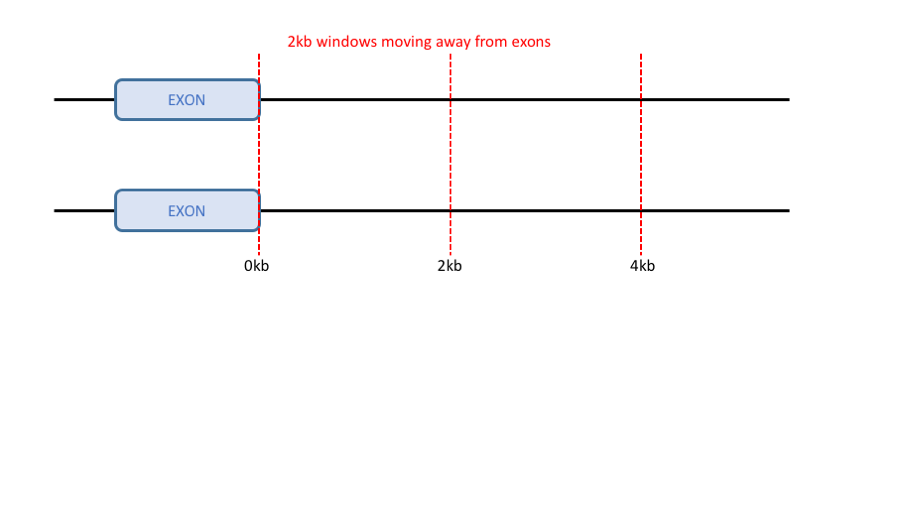

## Approach

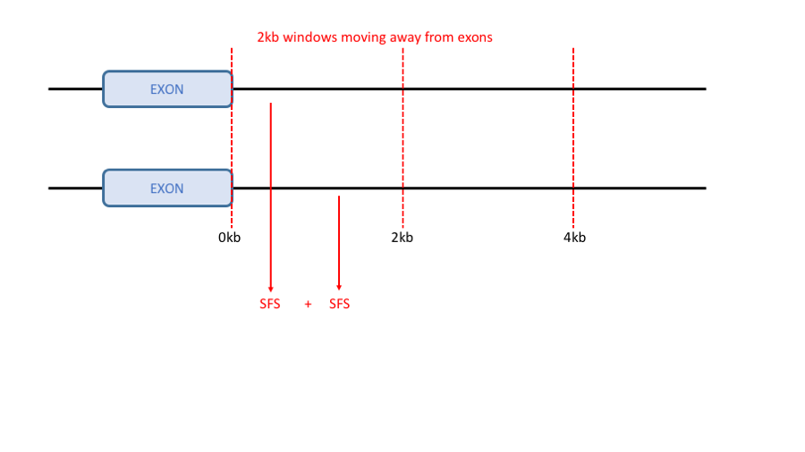

## Approach

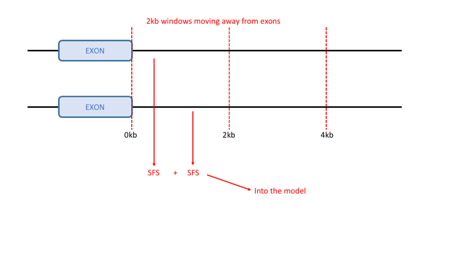

## Diversity increases with distance

```{R, echo=FALSE, warning=FALSE, message=FALSE, fig.width=16, fig.height=9, fig.align='center'}
library(gtools)

in_file = '~/parus_indel/gene_proximity_analyses/gt_nc_v_ar_2kb_wind_cds.results.csv'
window_size = 2

prox_data = read.csv(in_file)

prox_data$bin = factor(prox_data$bin, levels=mixedsort(as.character(subset(prox_data, sel_type=='sel' & var_type=='ins')$bin)))
prox_data$mean_gamma = as.numeric(as.character(prox_data$shape)) * as.numeric(as.character(prox_data$scale)) * -1
prox_data$distance = as.numeric(prox_data$bin) * window_size

ins_theta = subset(prox_data, sel_type == 'sel' & var_type == 'ins', select=c(bin, theta, distance))
colnames(ins_theta) = c('bin', 'ins_theta', 'distance')

theta_ins_test = cor.test(as.numeric(ins_theta$ins_theta), ins_theta$distance, method='spearman', exact=NULL)
#length(ins_theta$distance)

del_theta = subset(prox_data, sel_type == 'sel' & var_type == 'del', select=c(bin, theta, distance))
colnames(del_theta) = c('bin', 'del_theta', 'distance')

theta_del_test = cor.test(as.numeric(del_theta$del_theta), del_theta$distance, method='spearman', exact=NULL)

rdi_data = as.data.frame(cbind(ins_theta, del_theta$del_theta))
rdi_data$rdi = rdi_data$del_theta / rdi_data$ins_theta

#cor.test(as.numeric(rdi_data$rdi), as.numeric(rdi_data$bin), method='spearman', exact=NULL)

theta_plot = ggplot(subset(prox_data, sel_type=='sel'), aes(x=distance, y=theta*10000, colour=toupper(var_type))) +
      geom_hline(yintercept=2.93, colour=pal[1], size=3, linetype=2) +
      geom_hline(yintercept=1.7, colour=pal[2], size=3, linetype=2) +
      geom_point(stat='identity', size = 7) +
      theme_grey(base_size=plot_base_size) +
      #xlim(0,10000)+
      ylab(expression(theta * x *10^-4))  + xlab('Distance from exons (kb)') +
      theme(legend.title = element_blank(), legend.position = c(0.15, 0.87), legend.background = element_blank()) +
      scale_colour_manual(values=pal)+
      ggtitle(paste('Ins: ', expression(rho), '=', round(theta_ins_test$estimate, digits=2),
      'p < 0.05',
      '\nDel: ', expression(rho), '=', round(theta_del_test$estimate, digits=2),
      'p < 0.01'))


# pi plot
sum_file = read.delim('~/parus_indel/gene_proximity_analyses/gt_prox_summary_stats.txt')
call_file = read.delim('~/parus_indel/gene_proximity_analyses/gt_prox_call.txt')

all_data = cbind(sum_file, call_file)
all_data[7] = NULL
all_data[7] = NULL

all_data$dist = as.numeric(sapply(strsplit(as.character(all_data$category), 'bin'), "[[", 2)) * 2

all_data$pi_per_site = all_data$pi / all_data$callable

ins_theta = subset(all_data, variation == 'INS', select=c(category, pi_per_site, dist))
colnames(ins_theta) = c('bin', 'ins_theta', 'distance')

theta_ins_test = cor.test(as.numeric(ins_theta$ins_theta), ins_theta$distance, method='spearman', exact=NULL)

del_theta = subset(all_data, variation == 'DEL', select=c(category, pi_per_site, dist))
colnames(del_theta) = c('bin', 'del_theta', 'distance')

theta_del_test = cor.test(as.numeric(del_theta$del_theta), del_theta$distance, method='spearman', exact=NULL)

pi_plot = ggplot(subset(all_data, variation!='SNP' & variation!='INDEL'), aes(x=dist, y=pi_per_site*10000, colour=variation)) +
      geom_point(stat='identity', size = 7) +
      geom_hline(yintercept=0.000165982911468325 * 10000, colour=pal[1], size=3, linetype=2) +
      geom_hline(yintercept=0.000127925735552617 * 10000, colour=pal[2], size=3, linetype=2) +
      theme_grey(base_size=plot_base_size) +
      #xlim(0,10000)+
      ylab(expression(pi* x *10^-4))  + xlab('Distance from exons (kb)') +
      theme(legend.position = 'none', legend.background = element_blank())+
      ggtitle(paste('Ins: ', expression(rho), '=', round(theta_ins_test$estimate, digits=2),
      'p < 0.01',
      '\nDel: ', expression(rho), '=', round(theta_del_test$estimate, digits=2),
      'p < 0.01')) +
      scale_colour_manual(values=pal)

grid.arrange(theta_plot, pi_plot, nrow=1)
#theta_plot
```
<!---
# Linked selection?

## Linked selection

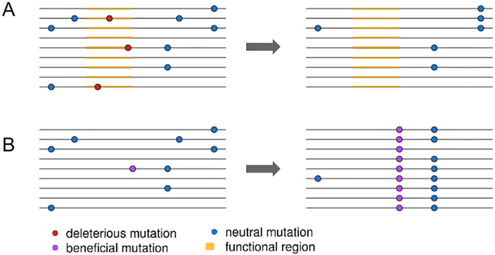

<div style="position:absolute;bottom:4%;left:5%;width:450px;font-size:11pt;"> (Cropped from fig 1. Josephs and Wright, 2016) </div>

## Two possible explanations

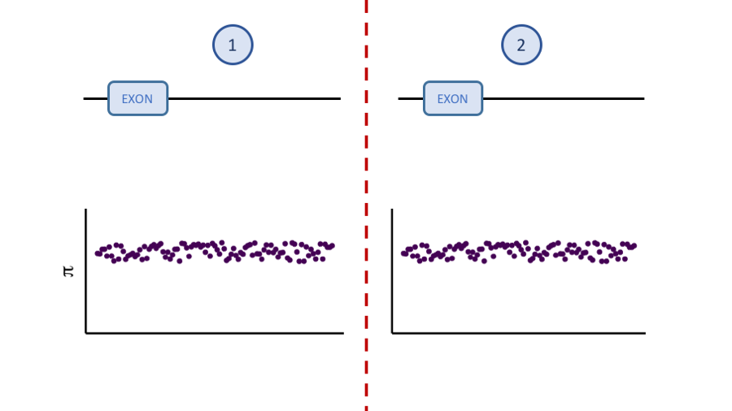

## Two possible explanations

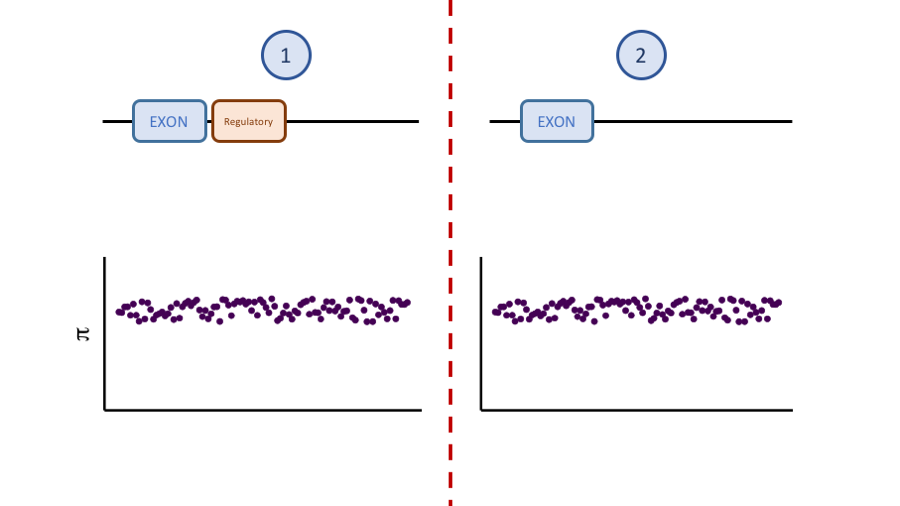

## Two possible explanations


## Two possible explanations

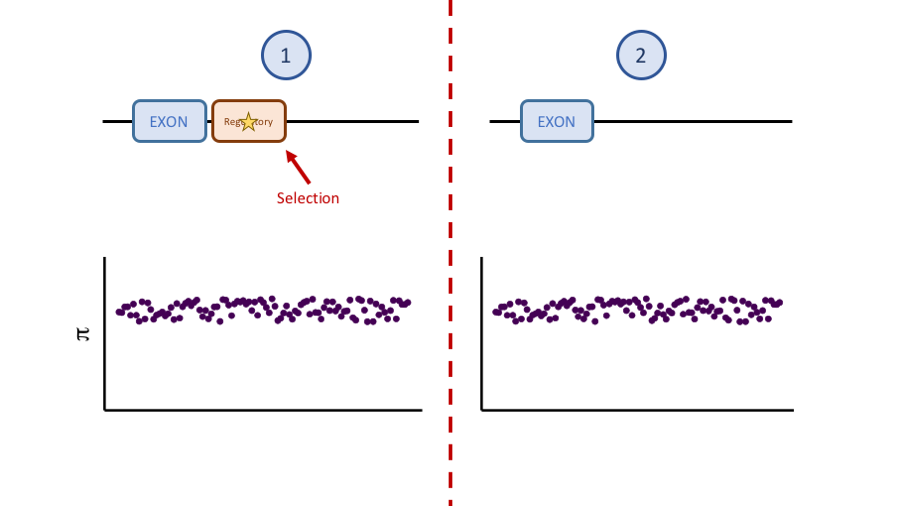

## Two possible explanations

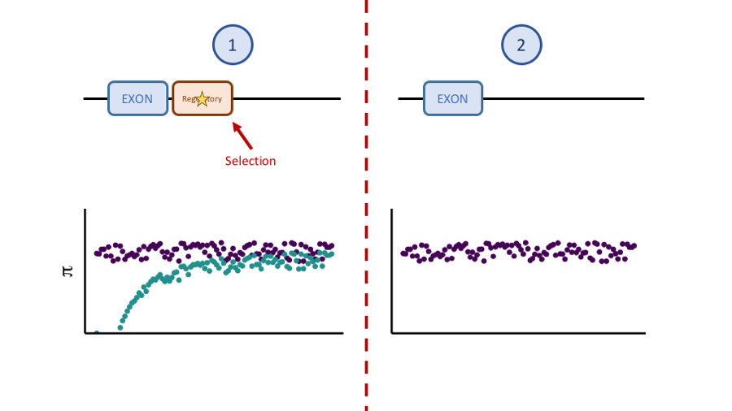

## Two possible explanations

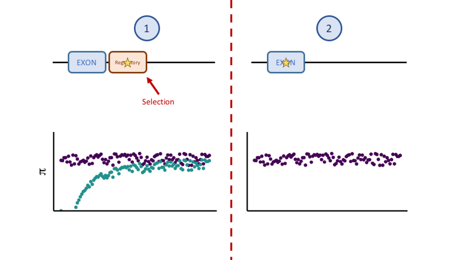

## Two possible explanations

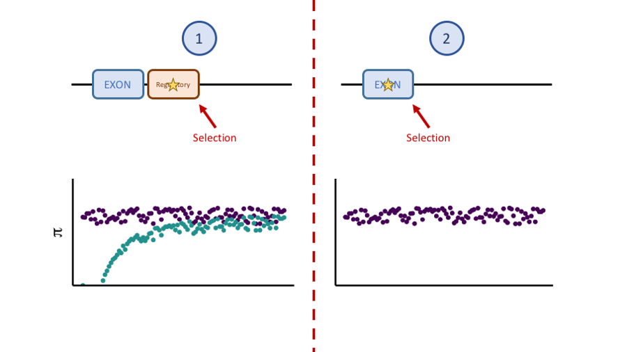

## Two possible explanations

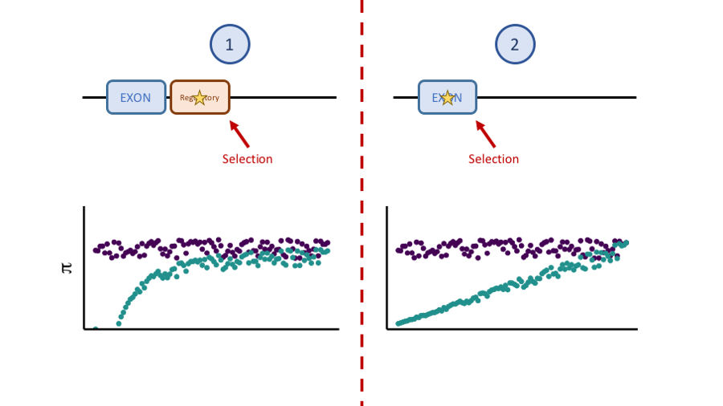

## Driven by neutral variation

```{R, echo=FALSE, warning=FALSE, message=FALSE, fig.width=16, fig.height=9, fig.align='center'}
dfe = read.delim('~/parus_indel/gene_proximity_analyses/nc_dfe_exon_dist.txt')

dfe$cat_theta = dfe$theta * dfe$prop

dfe$cat = factor(dfe$cat, levels=c('0 - 1', '>1'))
ggplot(dfe, aes(x=dist*2, y=cat_theta*10000, colour=toupper(var))) +
    geom_point(stat='identity', size=5) +
    # geom_smooth(method='lm', se=F) +
    theme_grey(base_size = plot_base_size) +
    scale_colour_manual(values=viridis(3)) +
    facet_wrap(~cat, nrow=1, ncol=2) + #, scales='free') +
    xlab('Distance from exons (kb)') + ylab(expression(theta*x*10^-4)) +
    theme(legend.title=element_blank(), legend.position=c(0.07, 0.15)) +
    #legend.key.size = unit(.4, "cm"), legend.text=element_text(size=8)) +
    guides(fill=guide_legend(ncol=2))

```

## How far does the correlation persist?

```{R, echo=FALSE, warning=FALSE, message=FALSE, fig.width=16, fig.height=9, fig.align='center'}
theta_plot = ggplot(subset(prox_data, sel_type=='sel'), aes(x=distance, y=theta*10000, colour=toupper(var_type))) +
      geom_point(stat='identity', size = 7) +
      theme_grey(base_size=plot_base_size) +
      xlim(0,100)+
      ylab(expression(theta * x *10^-4))  + xlab('Distance from exons (kb)') +
      theme(legend.title = element_blank(), legend.position = c(0.15, 0.87), legend.background = element_blank()) +
      scale_colour_manual(values=pal)+
      ylim(min(prox_data$theta)*10000, max(prox_data$theta)*10000)

pi_plot = ggplot(subset(all_data, variation!='SNP' & variation!='INDEL'), aes(x=dist, y=pi_per_site*10000, colour=variation)) +
      geom_point(stat='identity', size = 7) +
      theme_grey(base_size=plot_base_size) +
      xlim(0,100)+
      ylab(expression(pi* x *10^-4))  + xlab('Distance from exons (kb)') +
      theme(legend.position = 'none', legend.background = element_blank())+
      scale_colour_manual(values=pal) +
      ylim(min(subset(all_data, variation!='SNP' & variation!='INDEL')$pi_per_site)*10000, max(subset(all_data, variation!='SNP' & variation!='INDEL')$pi_per_site)*10000)

grid.arrange(theta_plot, pi_plot, nrow=1)
```

## How far does the correlation persist?

```{R, echo=FALSE, warning=FALSE, message=FALSE, fig.width=16, fig.height=9, fig.align='center'}
theta_plot = ggplot(subset(prox_data, sel_type=='sel' & distance>25), aes(x=distance, y=theta*10000, colour=toupper(var_type))) +
      geom_point(stat='identity', size = 7)+
      geom_vline(xintercept=25, linetype="dashed", color = "tomato 3", size=2) +
      theme_grey(base_size=plot_base_size) +
      xlim(0,100)+
      ylab(expression(theta * x *10^-4))  + xlab('Distance from exons (kb)') +
      theme(legend.title = element_blank(), legend.position = c(0.15, 0.87), legend.background = element_blank()) +
      scale_colour_manual(values=pal) +
      ylim(min(prox_data$theta)*10000, max(prox_data$theta)*10000)

pi_plot = ggplot(subset(all_data, variation!='SNP' & variation!='INDEL'& dist>25), aes(x=dist, y=pi_per_site*10000, colour=variation)) +
      geom_point(stat='identity', size = 7)+
      geom_vline(xintercept=25, linetype="dashed", color = "tomato 3", size=2) +
      theme_grey(base_size=plot_base_size) +
      xlim(0,100)+
      ylab(expression(pi* x *10^-4))  + xlab('Distance from exons (kb)') +
      theme(legend.position = 'none', legend.background = element_blank())+
      scale_colour_manual(values=pal)+
      ylim(min(subset(all_data, variation!='SNP' & variation!='INDEL')$pi_per_site)*10000, max(subset(all_data, variation!='SNP' & variation!='INDEL')$pi_per_site)*10000)

grid.arrange(theta_plot, pi_plot, nrow=1)
```
## How far does the correlation persist?

```{R, echo=FALSE, warning=FALSE, message=FALSE, fig.width=16, fig.height=9, fig.align='center'}
theta_plot = ggplot(subset(prox_data, sel_type=='sel' & distance>50), aes(x=distance, y=theta*10000, colour=toupper(var_type))) +
      geom_point(stat='identity', size = 7)+
      geom_vline(xintercept=50, linetype="dashed", color = "tomato 3", size=2) +
      theme_grey(base_size=plot_base_size) +
      xlim(0,100)+
      ylab(expression(theta * x *10^-4))  + xlab('Distance from exons (kb)') +
      theme(legend.title = element_blank(), legend.position = c(0.15, 0.87), legend.background = element_blank()) +
      scale_colour_manual(values=pal)+
      ylim(min(prox_data$theta)*10000, max(prox_data$theta)*10000)

pi_plot = ggplot(subset(all_data, variation!='SNP' & variation!='INDEL'& dist>50), aes(x=dist, y=pi_per_site*10000, colour=variation)) +
      geom_point(stat='identity', size = 7)+
      geom_vline(xintercept=50, linetype="dashed", color = "tomato 3", size=2) +
      theme_grey(base_size=plot_base_size) +
      xlim(0,100)+
      ylab(expression(pi* x *10^-4))  + xlab('Distance from exons (kb)') +
      theme(legend.position = 'none', legend.background = element_blank())+
      scale_colour_manual(values=pal)+
      ylim(min(subset(all_data, variation!='SNP' & variation!='INDEL')$pi_per_site)*10000, max(subset(all_data, variation!='SNP' & variation!='INDEL')$pi_per_site)*10000)

grid.arrange(theta_plot, pi_plot, nrow=1)
```

## How far does the correlation persist?

```{R, echo=FALSE, warning=FALSE, message=FALSE, fig.width=16, fig.height=9, fig.align='center'}
theta_plot = ggplot(subset(prox_data, sel_type=='sel' & distance>75), aes(x=distance, y=theta*10000, colour=toupper(var_type))) +
      geom_point(stat='identity', size = 7)+
      geom_vline(xintercept=75, linetype="dashed", color = "tomato 3", size=2) +
      theme_grey(base_size=plot_base_size) +
      xlim(0,100)+
      ylab(expression(theta * x *10^-4))  + xlab('Distance from exons (kb)') +
      theme(legend.title = element_blank(), legend.position = c(0.15, 0.87), legend.background = element_blank()) +
      scale_colour_manual(values=pal)+
      ylim(min(prox_data$theta)*10000, max(prox_data$theta)*10000)

pi_plot = ggplot(subset(all_data, variation!='SNP' & variation!='INDEL'& dist>75), aes(x=dist, y=pi_per_site*10000, colour=variation)) +
      geom_point(stat='identity', size = 7)+
      geom_vline(xintercept=75, linetype="dashed", color = "tomato 3", size=2) +
      theme_grey(base_size=plot_base_size) +
      xlim(0,100)+
      ylab(expression(pi* x *10^-4))  + xlab('Distance from exons (kb)') +
      theme(legend.position = 'none', legend.background = element_blank())+
      scale_colour_manual(values=pal)+
      ylim(min(subset(all_data, variation!='SNP' & variation!='INDEL')$pi_per_site)*10000, max(subset(all_data, variation!='SNP' & variation!='INDEL')$pi_per_site)*10000)

grid.arrange(theta_plot, pi_plot, nrow=1)
```

## How far does the correlation persist?

```{R, echo=FALSE, warning=FALSE, message=FALSE, fig.width=16, fig.height=9, fig.align='center'}
# getting theta anavar data estimates into shape

theta_data = read.csv('~/parus_indel/gene_proximity_analyses/gt_nc_v_ar_2kb_wind_cds.results.csv')
window_size = 2

theta_data$bin = factor(theta_data$bin, levels=mixedsort(as.character(subset(theta_data, sel_type=='sel' & var_type=='ins')$bin)))
theta_data$distance = as.numeric(theta_data$bin) * window_size
theta_data = subset(theta_data, sel_type=='sel', select=c('theta', 'var_type', 'distance'))

theta_cors = NULL

# getting pi estimates into shape

sum_file = read.delim('~/parus_indel/gene_proximity_analyses/gt_prox_summary_stats.txt')
call_file = read.delim('~/parus_indel/gene_proximity_analyses/gt_prox_call.txt')

pi_data = cbind(sum_file, call_file)
pi_data[7] = NULL
pi_data[7] = NULL

pi_data$dist = as.numeric(sapply(strsplit(as.character(pi_data$category), 'bin'), "[[", 2)) * 2

pi_data$pi_per_site = pi_data$pi / pi_data$callable

pi_data = subset(pi_data, variation == 'DEL' | variation == 'INS', select=c('pi_per_site', 'variation', 'dist'))
colnames(pi_data) <- c('theta', 'var_type', 'distance')
pi_data$var_type = as.factor(tolower(pi_data$var_type))

for(data in c('theta', 'pi')){

    if(data == 'theta'){target_set=theta_data}else{target_set=pi_data}

    for(variant in c('ins', 'del')){

        var_data = subset(target_set, var_type==variant)

        for(i in 1:length(var_data$theta)-1){

            trimmed_set = var_data[i:length(var_data$theta),]

            test = cor.test(as.numeric(trimmed_set$theta), trimmed_set$distance, method='spearman', exact=NULL)
            p = test$p.value
            rho = test$estimate
            if(p > 0.05){
                sig = 'p > 0.05'
            }else{
                sig = 'p <= 0.05'}

            out_row = c(i * window_size, p, rho, variant, sig, data)
            theta_cors = rbind(theta_cors, out_row)
        }
    }
}
theta_cors = as.data.frame(theta_cors)
colnames(theta_cors) = c('min_dist', 'p', 'rho', 'var_type', 'p_cat', 'param')

pal = viridis(n=3)[1:3]

theta_plot = ggplot(theta_cors, aes(x=as.numeric(as.character(min_dist)), y=as.numeric(as.character(rho)), colour=toupper(var_type), shape=p_cat)) +
      geom_point(stat='identity', size=5) +
      theme_grey(base_size = plot_base_size) +
      #xlim(0,10000)+
      ylab(expression(rho))  + xlab('Distance of first bin from exon (kb)') +
      facet_wrap(~param, nrow=1, labeller=label_parsed) +
      theme(legend.title = element_blank(), legend.position = c(0.15, 0.15),
            legend.background = element_blank(), legend.box = "horizontal") +
      scale_colour_manual(values=pal)

theta_plot
```
--->

# Recombination should modulate the impact of linked selection

## Getting the data

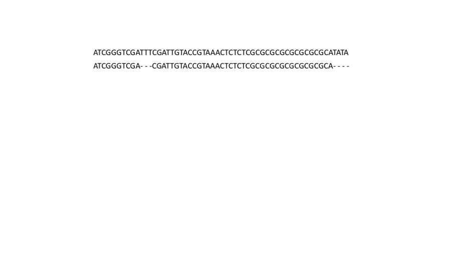


## Getting the data

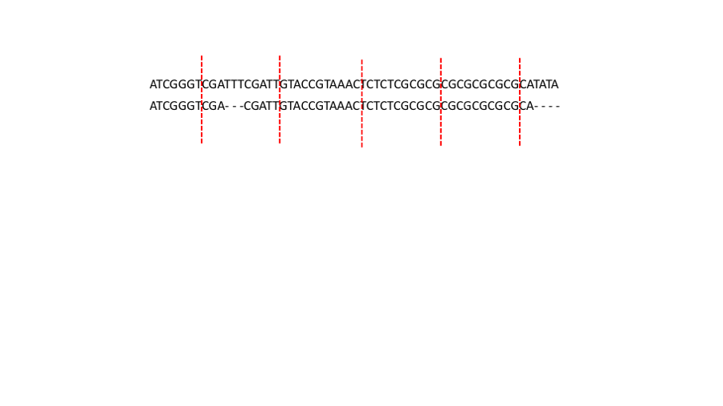

## Getting the data

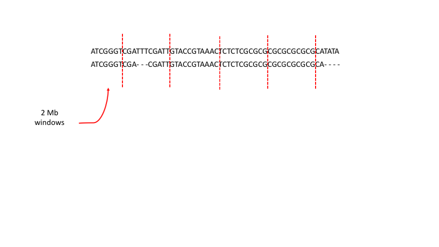

## Getting the data

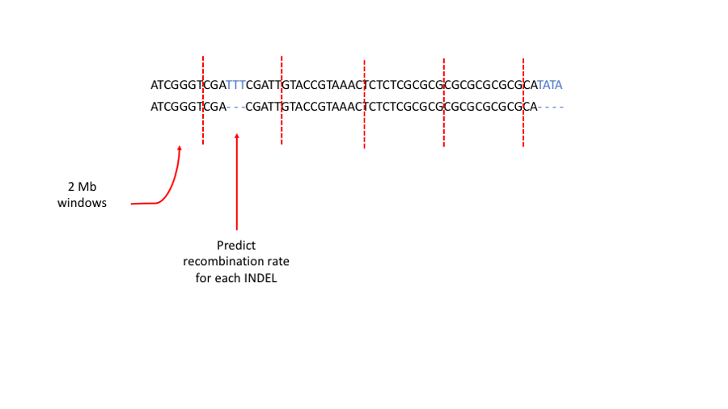


## Getting the data - recombination rate

```{r, echo=FALSE, fig.width=16, fig.height=9}

# plotting recomb maps from linkage data
recomb_data <- read.delim('/Users/henryjuho/genomics/GT_recomb/recomb_model_data.txt')
new_recomb_data <- na.omit(recomb_data)
new_recomb_data <- new_recomb_data[grep('chr[[:digit:]]{1,2}$', new_recomb_data$CHR),]

ggplot(subset(new_recomb_data, CHR=='chr5'), aes(x = POS/1000000, y = RECOMB)) +
  geom_point(size=7) +
  stat_smooth(method="lm", se=FALSE, fill=NA, formula=y ~ poly(x, 3, raw=TRUE), size=3) +
  theme_grey(base_size=plot_base_size) +
  labs(x='Physical position (Mb)', y='cM position')
```


## Getting the data

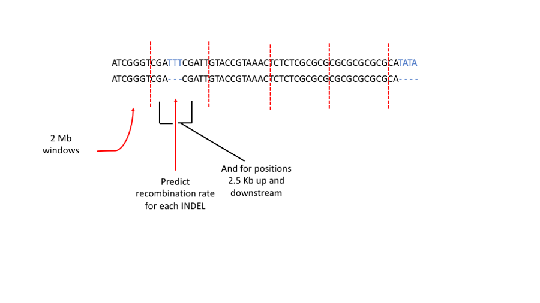


## Getting the data

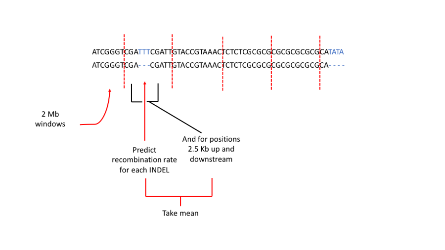

## Getting the data

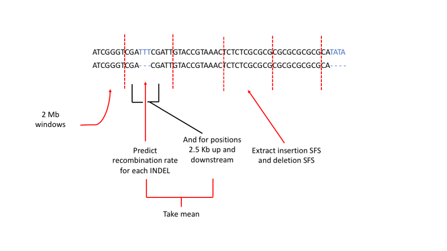


## Getting the data

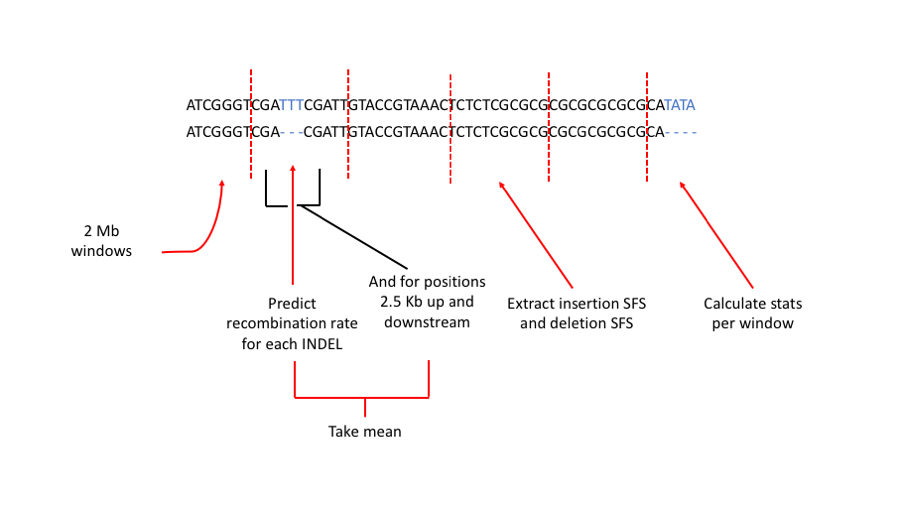


## Association between diversity and recombination

```{R, echo=FALSE, warning=FALSE, message=FALSE, fig.width=16, fig.height=9}
library(reshape2)
# summary stat results
window_data = read.delim('~/parus_indel/recombination_analyses/filtered_2Mb_windows.txt')

#cor.test(window_data$tajd_ins, window_data$rec_rate, method='spearman', exact=NULL)
#cor.test(window_data$tajd_del, window_data$rec_rate, method='spearman', exact=NULL)

theta_ins_test = cor.test(window_data$theta_ins, window_data$rec_rate, method='spearman', exact=NULL)
tajd_ins_test = cor.test(window_data$tajd_ins, window_data$rec_rate, method='spearman', exact=NULL)
pi_ins_test = cor.test(window_data$pi_ins, window_data$rec_rate, method='spearman', exact=NULL)

theta_del_test = cor.test(window_data$theta_del, window_data$rec_rate, method='spearman', exact=NULL)
tajd_del_test = cor.test(window_data$tajd_del, window_data$rec_rate, method='spearman', exact=NULL)
pi_del_test = cor.test(window_data$pi_del, window_data$rec_rate, method='spearman', exact=NULL)

# rdi data
rdi_data = subset(window_data, select=c(window, rec_rate, theta_ins, theta_del))
colnames(rdi_data) = c('window', 'rec_rate', 'ins', 'del')
rdi_data$rdi = rdi_data$del / rdi_data$ins
#cor.test(rdi_data$rdi, rdi_data$rec_rate, method='spearman', exact=NULL)
rdi_data$filter = 'No filter'

pal = viridis(n=3)[1:3]

# pi plot
pi_data = subset(window_data, select=c(window, rec_rate, pi_ins, pi_del))
colnames(pi_data) = c('window', 'rec_rate', 'ins', 'del')
pi_data = melt(pi_data, id=c('window', 'rec_rate'))
pi_data$variable = factor(pi_data$variable, levels=c('del', 'ins'))

pi_plot = ggplot(pi_data, aes(x=log(rec_rate + 1), y=value*10000, colour=toupper(variable))) +
      geom_point(stat='identity', size = 7) +
      theme_grey(base_size=plot_base_size) +
      xlab('Recombination rate (log)')  + ylab(expression(pi * x *10^-4)) +
      theme(legend.position = 'none') +
      scale_colour_manual(values=pal) +
      ggtitle(paste('Ins: ', expression(rho), '=', round(pi_ins_test$estimate, digits=2),
      'p < 0.05',
      '\nDel: ', expression(rho), '=', round(pi_del_test$estimate, digits=2),
      'p < 0.01'))


# tajd plot
tajd_data = subset(window_data, select=c(window, rec_rate, tajd_ins, tajd_del))
colnames(tajd_data) = c('window', 'rec_rate', 'ins', 'del')
tajd_data = melt(tajd_data, id=c('window', 'rec_rate'))
tajd_data$variable = factor(tajd_data$variable, levels=c('del', 'ins'))

tajd_plot = ggplot(tajd_data, aes(x=log(rec_rate + 1), y=value, colour=toupper(variable))) +
      geom_point(stat='identity', size = 7) +
      theme_grey(base_size=plot_base_size) +
      xlab('Recombination rate (log)')  + ylab("Tajima's D") +
      theme(legend.position=c(0.85, 0.15), legend.title=element_blank(), legend.background=element_blank())+
      scale_colour_manual(values=pal) +
      ggtitle(paste('Ins: ', expression(rho), '=', round(tajd_ins_test$estimate, digits=2),
      'p < 0.01',
      '\nDel: ', expression(rho), '=', round(tajd_del_test$estimate, digits=2),
      'p < 0.01'))

grid.arrange(pi_plot, tajd_plot, nrow=1)


## with filters

# summary stat results
window_data2 = read.delim('~/parus_indel/recombination_analyses/filtered_2Mb_windows_percentpol.txt')
window_data2 = subset(window_data2, pol_success > 0.6)

#cor.test(window_data2$tajd_ins, window_data2$rec_rate, method='spearman', exact=NULL)
#cor.test(window_data2$tajd_del, window_data2$rec_rate, method='spearman', exact=NULL)

# rdi plot
rdi_data2 = subset(window_data2, select=c(window, rec_rate, theta_ins, theta_del))
colnames(rdi_data2) = c('window', 'rec_rate', 'ins', 'del')
rdi_data2$rdi = rdi_data2$del / rdi_data2$ins
#cor.test(rdi_data2$rdi, rdi_data2$rec_rate, method='spearman', exact=NULL)
rdi_data2$filter = '60% min polarised'

rdi_all = rbind(rdi_data, rdi_data2)


rdi_plot = ggplot(rdi_all, aes(x=log(rec_rate + 1), y=rdi)) +
      geom_point(stat='identity', size = 2) +
      geom_smooth(method='lm', se=FALSE) +
      theme_grey() +
      xlab('Recombination rate (log)')  + ylab('rDI') +
      theme(plot.title=element_text(hjust=-0.2, vjust=-3)) +
      facet_wrap(~filter, scale = 'free_x')


# pi plot
pi_data2 = subset(window_data2, select=c(window, rec_rate, pi_ins, pi_del))
colnames(pi_data2) = c('window', 'rec_rate', 'ins', 'del')
pi_data2 = melt(pi_data2, id=c('window', 'rec_rate'))
pi_data2$variable = factor(pi_data2$variable, levels=c('del', 'ins'))

pi_plot2 = ggplot(pi_data2, aes(x=log(rec_rate + 1), y=value*10000, colour=toupper(variable))) +
      geom_point(stat='identity', size = 2) +
      theme_grey() +
      xlab('Recombination rate (log)')  + ylab(expression(pi * x *10^-4)) +
      theme(legend.position = 'none', plot.title=element_text(hjust=-0.2, vjust=-3)) +
      ggtitle('(a)')+ scale_colour_manual(values=pal)


# tajd plot
tajd_data2 = subset(window_data2, select=c(window, rec_rate, tajd_ins, tajd_del))
colnames(tajd_data2) = c('window', 'rec_rate', 'ins', 'del')
tajd_data2 = melt(tajd_data2, id=c('window', 'rec_rate'))
tajd_data2$variable = factor(tajd_data2$variable, levels=c('del', 'ins'))

tajd_plot2 = ggplot(tajd_data2, aes(x=log(rec_rate + 1), y=value, colour=toupper(variable))) +
      geom_point(stat='identity', size = 2) +
      theme_grey() +
      xlab('Recombination rate (log)')  + ylab("Tajima's D") +
      theme(legend.position=c(0.85, 0.2), legend.title=element_blank(), legend.background=element_blank(),
      plot.title=element_text(hjust=-0.3, vjust=-3))+
      ggtitle('(b)') + scale_colour_manual(values=pal)
```


# Round up

## Conclusion

* INDELs in genes mostly extremely deleterious - 96%
* Remainder are weakly deleterious
* $\alpha$ estimate at 71% and 86% for insertions and deletions 
* Regions adjacent to exons, and areas of low recombination, have reduced INDEL diversity - linked selection
* Extends over relatively large distance up to ~50kb

## Next steps

* Interesting to investigate if reduced diversity is due to positive selection or purifying selection
* Look at whether efficacy of selection on INDELs is higher in regions with higher $N_e$

## Plug for the model

* User friendly computer package - anavar - <http://zeng-lab.group.shef.ac.uk>
* Methods are applicable to both INDELs and SNPs or a combination
* Code for integration with python - <https://henryjuho.github.io/anavar_utils/>


# Questions?